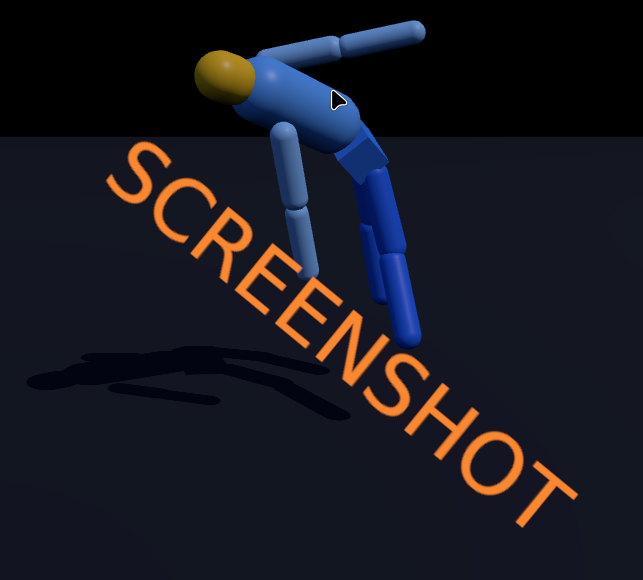

# js_rapier_ragdoll_v1

# Three.js + Rapier Ragdoll (Limits & Speed Cap)

A tiny single-file demo that renders a simple ragdoll in **Three.js** and simulates physics using **Rapier (rapier3d-compat)**.

It includes:

- A **ragdoll** built from capsules + a pelvis box  
- **Spherical joints** for spine, head, shoulders, hips  
- **Revolute joints with limits** for elbows + knees  
- A **mouse drag system** using a kinematic handle body + impulse joint  
- **Velocity clamping** (linear + angular) to prevent “exploding” joints  
- OrbitControls camera (scroll zoom + orbit)

---

## Screenshots


## Features

### ✅ Joint Types
- **Spherical joints** (free rotation):
  - pelvis ↔ torso
  - torso ↔ head
  - torso ↔ upper arms
  - pelvis ↔ upper legs

- **Revolute joints with limits** (hinges):
  - elbows (0 → 2.5 radians)
  - knees (-2.5 → 0 radians)

### ✅ Speed Limiter (Stability Fix)
Each physics step clamps:

- **Linear velocity** to `MAX_LINEAR_VELOCITY = 10`
- **Angular velocity** to `MAX_ANGULAR_VELOCITY = 15`

This prevents the ragdoll from gaining insane speeds when dragged hard.

### ✅ Drag System
Left-click on any ragdoll part to grab it.

Implementation details:

- A hidden **kinematicPositionBased** rigid body acts as a drag handle.
- A **spherical impulse joint** connects the handle to the clicked body.
- The handle follows the mouse projected onto a plane facing the camera.

---

## Controls

- **Left Click + Drag** → grab ragdoll parts  
- **Mouse Wheel** → zoom  
- **Right Click / Middle Drag** → orbit (OrbitControls default)

---

## Requirements

This project uses only CDN imports and runs in any modern browser.

### Libraries (CDN)
- [Three.js](https://threejs.org/)
- [Rapier Physics](https://rapier.rs/) (`@dimforge/rapier3d-compat`)
- OrbitControls from Three.js examples

---

## How to Run

Because this is an ES module project, you should run it using a local web server.

### Option A: Python (recommended)

```bash
python3 -m http.server 8000
```

Then open:

```
http://localhost:8000
```

### Option B: Node.js

```bash
npx serve
```

---

## File Structure

This is intentionally minimal:

```
.
└── index.html
```

---

## Customization Tips

### Change gravity
```js
const gravity = { x: 0, y: -9.81, z: 0 };
```

### Make it more “rubbery” or more stable
Try adjusting damping:

```js
.setLinearDamping(0.5)
.setAngularDamping(0.5)
```

And drag joint stiffness/damping:

```js
params.stiffness = 1.0;
params.damping = 1.0;
```

### Increase or decrease max speed caps
```js
const MAX_LINEAR_VELOCITY = 10.0;
const MAX_ANGULAR_VELOCITY = 15.0;
```

---

## Notes

- This demo uses **Impulse Joints** (not multibody joints).
- The joint limits are set by enabling:

```js
params.limitsEnabled = true;
params.limits = [minAngle, maxAngle];
```

(Some older examples use `setLimits()`, but this project uses the correct approach for this Rapier build.)

---

## License

MIT — do whatever you want with it. 🙂
